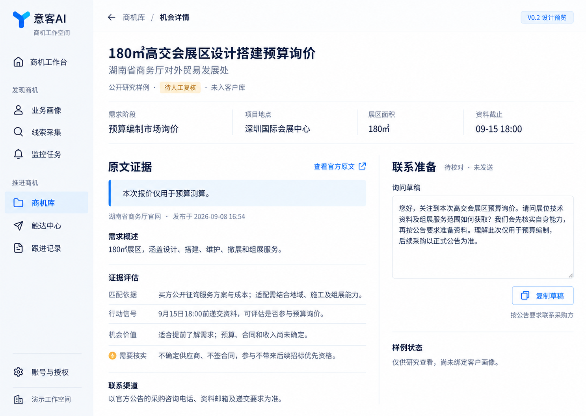

# 意客AI 产品设计入口

2026-09-09 · 设计交接包 · 静态设计，尚未实现为新版页面。

## 最新设计方向

沿用用户确定的蓝白科技风、Y 形 Logo 和左侧导航。视觉参考飞书、支付宝的清爽、紧凑与对齐方式；产品保持意客AI自己的标志与业务表达。

这张图展示机会详情与完整导航范围，使用公开研究样例；不是多平台运行结果或客户业绩。整体方向已确定，最终画面仍待用户选择，再按 image-to-code 实现。它也不代表任务创建、监控运行、触达与回复等其他页面已设计完成。

## 阅读顺序

1. [交接说明](../docs/V02_DESIGN_HANDOFF.md)：目标分支、已实现能力、演示分支差异与下一步。
2. [完整获客版计划](../docs/V02_COMMERCIAL_RELEASE_PLAN.md)：付费闭环、八个入口、十项工程任务、演示与发布标准。
3. [多平台 Skill 监控方案](../docs/V02_MULTIPLATFORM_SKILL_PLAN.md)：通用研究规则、平台规则、连接器、执行与数据边界。
4. [完整流程与范围复核](reviews/2026-09-09-v02-product-scope.md)：导航动作、源码能力、竞品研究背景及品牌约束。
5. [工作台生成记录](previews/WORKBENCH_V02_PROMPT.md)：输入用途、完整提示词、视觉目标和未验证项。

## 品牌资产与历史

- [蓝色 Y 标志 PNG](brand/yike-logo-blue-v1.png)：白底 RGB 图片，尚非透明 SVG/矢量母版。
- [Logo 生成记录](brand/IMAGEGEN_PROMPTS.md)：原始请求、白底修正及合成提示词。
- [V1 工作台图](previews/workbench-blue-logo-v1.png) 与 [V1 审查](reviews/2026-09-09-workbench-audit.md)：仅用于理解演进，三个入口布局已被 V0.2 八入口方案取代。

## 实现时遵循

- 八个一级入口：商机工作台、业务画像、线索采集、监控任务、商机库、触达中心、跟进记录、账号与授权。客户界面不显示 Skill 或底层采集引擎名称。
- 减少装饰卡片与重复说明，优先用字级、间距、对齐和分隔线组织内容。原文证据是主要区域，草稿是辅助区域。
- 生成图中的文字、圆角和像素只是视觉参考。落地时用真实字体与组件，统一字号、按钮、表单、图标、焦点、加载、空状态及错误反馈。
- 未实现功能进入开发计划；可演示和可销售状态由真实闭环验收决定。数量与结果来自数据库，未登录、受限、失败、无新增、发送结果未知分别呈现。
- 页面实现须同时验证真实数据、键盘操作、对比度和窄屏布局；静态图片不证明交互、响应式或无障碍通过。

实施与发布继续遵守 [AUTHORITY](../AUTHORITY.md)；客户试用生产验收使用 [CP-06 模板](../docs/DEPLOYMENT_ACCEPTANCE_CP06_TEMPLATE.md)。
