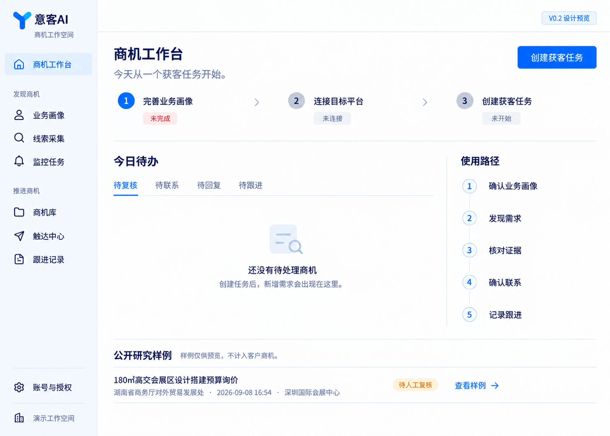

# 意客AI 产品设计入口

2026-09-09 · V0.2 全页面设计 R3 · 第一张精修方向已选定，整套待用户确认，尚未实现为新版页面。

## 最新设计方向

用户在三张 P06 精修候选中选择“第一个”，以实际首先展示的图片作为 R3 视觉基准；[选择记录](v02-suite-r3/APPROVAL.md)保留原话、来源和确认范围。

沿用用户确定的蓝白科技风、Y 形 Logo 和左侧导航。视觉参考飞书、支付宝的清爽、紧凑与对齐方式；产品保持意客AI自己的标志与业务表达。

**最新入口：[20 页完整设计图册](v02-suite-r3/README.md)。** 覆盖登录、八个一级入口、主要二级页、发送确认和平台连接，配套[页面与状态清单](v02-suite-r3/PAGE_STATE_MATRIX.md)、[组件规范](v02-suite-r3/DESIGN_SYSTEM.md)。整套待用户确认，不能逐页自行定稿。

图片使用公开研究样例、填写示例和状态示意，不是多平台运行结果或客户业绩。图册可逐页浏览，但图片里的产品按钮不执行业务操作。用户统一确认整套图与关键状态后，再按 image-to-code 实现并截图对照验收。

## 阅读顺序

1. [完整获客版计划](../docs/V02_COMMERCIAL_RELEASE_PLAN.md)：当前付费闭环、八个入口、功能与交付标准。
2. [实施任务书](../docs/V02_IMPLEMENTATION_TASKBOOK.md)：当前任务、设计/代码依赖与验收状态。
3. [多平台 Skill 监控方案](../docs/V02_MULTIPLATFORM_SKILL_PLAN.md)：通用规则、平台规则、连接器与执行数据边界。
4. [完整图册与生成记录](v02-suite-r3/README.md)：当前页面、图片摘要、提示词及统一确认流程；[此前工作台生成记录](previews/WORKBENCH_V02_PROMPT.md)是 P11 的历史内容来源。
5. [交接说明](../docs/V02_DESIGN_HANDOFF.md) 与 [范围复核](reviews/2026-09-09-v02-product-scope.md)：迁入快照、演示分支差异及竞品研究背景。

## 品牌资产与历史

- [完整 R2 图册](v02-suite/README.md)：精修前的 20 页设计，保留供对照。

- [蓝色 Y 标志 PNG](brand/yike-logo-blue-v1.png)：白底 RGB 图片，尚非透明 SVG/矢量母版。
- [Logo 生成记录](brand/IMAGEGEN_PROMPTS.md)：原始请求、白底修正及合成提示词。
- [V1 工作台图](previews/workbench-blue-logo-v1.png) 与 [V1 审查](reviews/2026-09-09-workbench-audit.md)：仅用于理解演进，三个入口布局已被 V0.2 八入口方案取代。

## 实现时遵循

- 八个一级入口：商机工作台、业务画像、线索采集、监控任务、商机库、触达中心、跟进记录、账号与授权。客户界面不显示 Skill 或底层采集引擎名称。
- 减少装饰卡片与重复说明，优先用字级、间距、对齐和分隔线组织内容。原文证据是主要区域，草稿是辅助区域。
- 生成图中的文字、圆角和像素只是视觉参考。落地时用真实字体与组件，统一字号、按钮、表单、图标、焦点、加载、空状态及错误反馈。
- 未实现功能进入开发计划；可演示和可销售状态由真实闭环验收决定。数量与结果来自数据库，未登录、受限、失败、无新增、发送结果未知分别呈现。
- 页面实现须同时验证真实数据、键盘操作、对比度和窄屏布局；静态图片不证明交互、响应式或无障碍通过。

实施与发布继续遵守 [AUTHORITY](../AUTHORITY.md)；客户试用生产验收使用 [CP-06 模板](../docs/DEPLOYMENT_ACCEPTANCE_CP06_TEMPLATE.md)。
