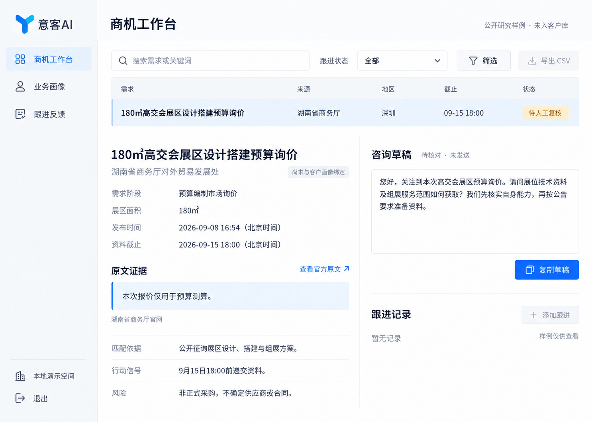

# 意客AI 蓝白工作台设计审查

日期：2026-09-09。范围：当时的 V1 静态设计稿。不是运行页面或全流程可用性验收。

历史记录：其中三个导航入口及“下一张图”的建议已由 [V0.2 八入口设计](../README.md) 取代；仅保留问题发现与视觉演进依据，不作为当前产品范围。

## 审查依据

该图在本次审查中重新打开并检查。下面的“步骤”是单张设计稿的阅读顺序，不表示已经点击验证这些功能。

## 总体判断

蓝白方向和左侧导航可以保留，主要问题在页面类型、信息主次和组件尺度。当前是一条只读研究样例，却同时展示列表工具、重复的选中行、完整详情、草稿和不可用的跟进操作。这使内容显得空而散，也容易让人以为部分功能尚未完成。

优点：品牌与动作色已统一；来源、阶段、未入库状态没有被伪造为客户商机；证据与草稿能区分；主导航只有三个入口。

## 按阅读顺序的发现

| 步骤 | 区域与健康度 | 图中证据 | 建议 |
| --- | --- | --- | --- |
| 1 | 进入工作空间：基本清楚，但视觉偏重 | Logo、页面标题和三个导航项占据较强视觉权重，左导航宽而内容少 | 保留左导航，收紧品牌与导航高度，不增加模块填空白；主内容建立更清楚的重点 |
| 2 | 浏览与选择：结构需改 | 一条表格行后再次完整展示相同标题；只有一个样例却有搜索、筛选和灰色导出 | 真实列表与机会详情分开。当前样例采用完整详情页，搜索/筛选/导出保留在客户列表中 |
| 3 | 判断机会：依据齐，但阅读次序弱 | 草稿与复制按钮很醒目，预算询价、截止时间、未绑定画像及采购限制分散 | 标题下归拢阶段、时间和状态；主体顺序为原文证据、适配依据、行动信号、风险。风险不能靠弱小灰字隐藏 |
| 4 | 准备联系及记录：容易产生未完工观感 | 灰色“添加跟进”、暂无记录、未入库和未绑定提示同时出现；草稿框和右下空白偏大 | 样例只呈现适用的查看原文和草稿复制。真实客户详情保留登记跟进。空态短小、清楚，不使用不能操作的大按钮填位置 |

## 下一张图的具体设计规格

以下数值是下一版目标，不是对当前图片 CSS 的测量：

- 桌面画板约 1440×1024，左导航约 200–208px；主内容边距 24–32px。
- 页头约 56–64px；页面标题 22–24px，中等字重；区块标题 16–18px；正文 14px；次信息 12–13px。
- 控件高度 32–36px；统一一套细描边图标、按钮圆角与字重，禁止每区自行放大。
- 当前样例使用完整详情页：一行位置与样例身份、一个主标题、紧凑元数据、原文证据和判断依据。
- 主证据栏约占可用内容宽度的 68%，草稿辅助栏约 32%。根据文字真实长度调整高度，避免为了两栏齐高而撑大表单。
- “查看官方原文”是该状态下首要动作；“复制草稿”是次要动作；样例不展示可误解为已实现业务动作的虚假入口。
- 日期/地区/面积用短信息组合，减少逐项占一整行；保留必要的来源与询价阶段，不用删除风险换取美观。
- 去掉重复表格和大段空白，不靠虚构机会、增长数字、回复记录、评分或新功能填充。

## 无障碍与证据边界

图中部分辅助说明和不可用按钮颜色较淡，存在可读性风险；需要实现后实际测量对比度。截图无法证明键盘顺序、焦点、语义标签、悬停、加载、错误恢复和响应式重排正常。

这是生成的设计图，字符边缘、字距、线宽和栅格不能作为真实组件规范直接使用。选定布局后，应使用真实字体和统一组件实现，再与目标图及实际数据状态一起验收。不能将本报告称为生产可用性或 WCAG 合规证明。

## 推荐的下一步

保留现有 Logo 和浅色蓝白方向，先出“紧凑左导航＋完整机会详情＋窄幅草稿辅助栏”的单页精修图。客户列表单独设计，不再将两个页面压进同一屏。待视觉选定，再用 image-to-code 落入现有真实业务代码。
